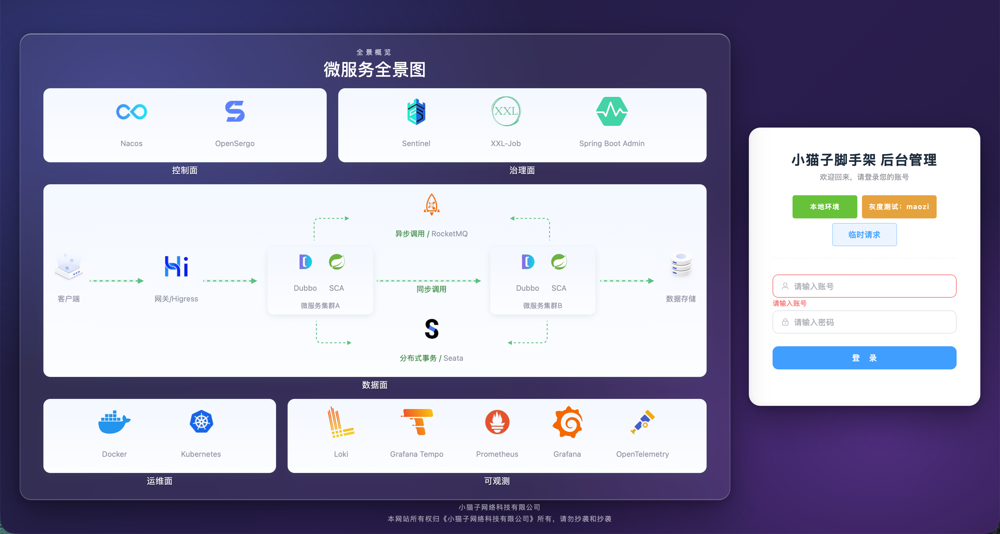

# maozi\-cloud\-parent

> 基于 Spring Cloud Alibaba \+ Dubbo 的一站式分布式解决方案开源封装，内置分布式应用开发所需全套组件，统一团队代码风格，保障代码质量，让开发者专注业务逻辑，实现高效快速开发。

## ✨ 核心特性

- **全链路灰度发布** — 精细化流量管控，平滑版本迭代

- **全链路完整日志** — 分布式追踪，问题定位一目了然

- **全链路回归测试** — 自动化质量保障体系

- **全链路压力测试** — 性能瓶颈提前发现

- **全套可观测监控** — Metrics / Tracing / Logging 三位一体

- **高效自动化部署** — 一键启动，贴近生产的本地调试体验

- **高性能分布式锁** — 开箱即用的分布式并发控制

- **声明式数据源查询** — 声明式数据库查询，减少样板代码

- **单体与微服务无缝切换** — 一套代码，灵活部署形态

## 🚧 规划中 / 待重构

以下组件基础功能可用，正在规划重构升级：

- Spring Cloud Alibaba 版本升级

- 方法异常自动手动重试

- 客户端长连接消息通信（ACK应答机制、重试发送消息、多实例兼容）

## 🏗️ 架构图

## 📚 相关链接

- [文档说明](https://github.com/1095071913/maozi-cloud-parent/blob/release/maozi-cloud-doc/框架文档目录.md)

- [联系作者](https://github.com/1095071913/1095071913/blob/release/wechat_qrcode.jpg)
